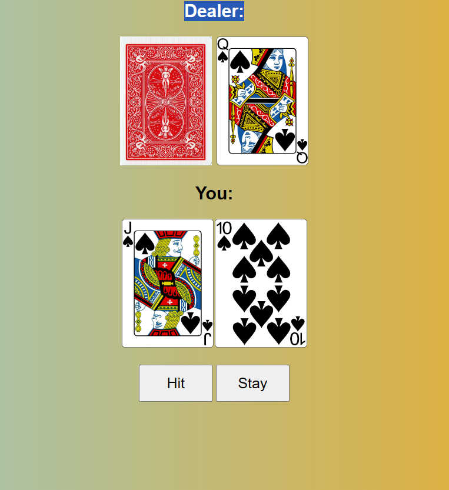

**Description**

This project is a web-based Blackjack game where you can play against the dealer. The game simulates the rules of Blackjack, where you aim to get a hand value as close to 21 as possible without going over. The dealer follows a specific set of rules for drawing cards.

**Getting Started**

**Prerequisites**

 Web browser (Chrome, Firefox, etc.)

 **How to Play**

    The dealer will deal two cards to you and two cards to themselves.
    Your goal is to have a hand value as close to 21 as possible without exceeding it.
    You can click the "Hit" button to receive additional cards.
    Click the "Stay" button when you're satisfied with your hand.
    The dealer follows specific rules for drawing cards.
    The game will announce the winner (or a tie) based on your and the dealer's hands.

**Unit Testing**

This project has undergone thorough unit testing to ensure the correctness and reliability of its core functions. We've used the Mocha testing framework in conjunction with the Chai assertion library for these tests.

**Running Unit Tests**

To run the unit tests locally, follow these steps:

1. Clone the project repository to your local machine if you haven't already: git clone <repository_url>

2. Navigate to the project directory: cd <project_directory>
 
3. Install the necessary dependencies for testing: npm install

4. Run the unit tests: npm test

This will execute the test suite and provide you with the test results, including information about which tests passed and which may have failed.

**Test Coverage**

Our unit tests cover critical aspects of the game, including:

- `buildDeck()`: Ensuring the correct construction of the deck, card counts, and specific card presence.
- `shuffleDeck(deck)`: Validating proper shuffling of the deck while preserving card count and integrity.
- `startGame()`: Verifying that game initialization sets player and dealer hands to their initial values.
- `hit()`: Testing the "Hit" function, including updating hand values and disabling hits when the player's hand exceeds 21.
- `stay()`: Testing the "Stay" function, which calculates game outcomes based on player and dealer hands and disables further hits.
- `getValue(card)`: Checking card value assignment, such as returning 11 for Aces and 10 for face cards.
- `checkAce(card)`: Confirming the function correctly identifies Ace cards.
- `reduceAce(playerSum, playerAceCount)`: Ensuring the Ace reduction logic functions correctly when the player's hand exceeds 21.

These unit tests provide comprehensive coverage and help maintain the game's integrity, allowing for confident development and future enhancements. Feel free to explore and extend these tests as the project evolves.

**Features**

    Simulates the classic Blackjack card game.
    Dynamic card drawing and gameplay.
    Realistic dealer AI based on the rules.
    Clear winner determination and results display.

**Technologies Used**

    HTML
    CSS
    JavaScript

**Contributing**

Contributions are welcome! If you find a bug or want to add new features, feel free to open an issue or submit a pull request. Please make sure to follow the code of conduct.

**Demo** 

